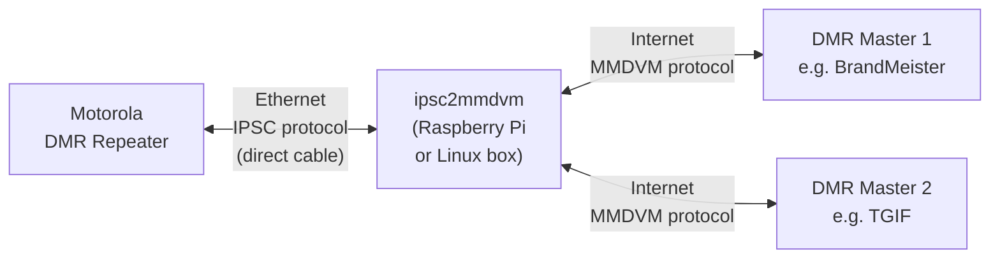

# ipsc2mmdvm

[](https://github.com/iu2tzo/ipsc2mmdvm/actions/workflows/release.yaml) [](https://github.com/iu2tzo/ipsc2mmdvm) [](https://goreportcard.com/report/github.com/iu2tzo/ipsc2mmdvm) [](https://github.com/iu2tzo/ipsc2mmdvm/blob/main/LICENSE) [](https://github.com/iu2tzo/ipsc2mmdvm/releases/) [](https://codecov.io/gh/iu2tzo/ipsc2mmdvm)

**Connect your Motorola IPSC repeater to MMDVM DMR Masters.**

ipsc2mmdvm is a protocol bridge that translates between Motorola's IP Site Connect (IPSC) protocol and the MMDVM Protocol. This lets your IPSC-only repeater talk to one or more DMR masters such as BrandMeister and TGIF simultaneously, with [DMRGateway](https://github.com/g4klx/DMRGateway)-compatible rewrite rules for routing talkgroups between networks.

## How It Works



In the most common setup, your repeater connects directly via Ethernet cable to the box running ipsc2mmdvm, which manages that interface's IP address for it (**managed mode**). The software acts as an IPSC master to the repeater and forwards voice and data traffic to and from one or more DMR masters over the internet. DMRGateway-style rewrite rules let you route specific talkgroups to specific masters.

This isn't the only supported topology, though: ipsc2mmdvm can also run on the same LAN as the repeater without managing its address (**bind-device mode**), or on a remote/cloud host with no direct network link to the repeater at all (**any mode**) — see [How ipsc2mmdvm Listens for the Repeater](#how-ipsc2mmdvm-listens-for-the-repeater) below.

## Requirements

- A **Motorola IPSC-capable DMR repeater**
- A host to run ipsc2mmdvm on: a **Raspberry Pi**, a **Linux box** on the same LAN as the repeater, or a **cloud VPS** — see [Connect the Hardware (or Network)](#4-connect-the-hardware-or-network) for which fits your setup
- An **Ethernet cable** to connect the repeater directly to that host — only required for the default direct-cable (managed mode) setup; not needed for the LAN or cloud-VPS setups
- **Internet access** on that host (via Wi-Fi on a Raspberry Pi, a second NIC on a Linux box, or natively on a VPS)
- A **DMR Master** with a registered repeater ID to connect to (e.g. BrandMeister)

## Setup

### 1. Download ipsc2mmdvm

Download the latest release tarball for your platform from the [GitHub Releases](https://github.com/iu2tzo/ipsc2mmdvm/releases/latest) page. For a Raspberry Pi, grab the [`linux_arm64`](https://github.com/iu2tzo/ipsc2mmdvm/releases/latest) build, for desktop Linux use [`linux_amd64`](https://github.com/iu2tzo/ipsc2mmdvm/releases/latest). Extract it and move the binary to your PATH:

```bash
tar xzf ipsc2mmdvm_*_linux_arm64.tar.gz
sudo mv ipsc2mmdvm /usr/local/bin/ipsc2mmdvm
```

### 2. Create the Config File

Download the example config, edit it, then move it into place:

```bash
wget https://raw.githubusercontent.com/iu2tzo/ipsc2mmdvm/main/config.example.yaml -O ipsc2mmdvm.yaml
nano ipsc2mmdvm.yaml
sudo mv ipsc2mmdvm.yaml /etc/ipsc2mmdvm.yaml
```

Here is the full example config with comments:

```yaml
# One of: debug, verbose, info, warn, error.
# "verbose" sits between debug and info: it adds extra connection-flow
# logging (repeater connect/disconnect, DMR master connect/reconnect, ...)
# without the much higher-volume per-packet logging that "debug" also
# turns on.
log-level: info

ipsc:
  # interface + ip below both set = "managed" mode: ipsc2mmdvm rewrites
  # eth0's addressing to ip/subnet-mask. See "How ipsc2mmdvm Listens for
  # the Repeater" below for the other two modes (bind-only and any-interface).
  interface: "eth0"       # The network interface connected to your repeater
  port: 50000             # UDP port the repeater will connect to
  ip: "10.10.250.1"       # IP address assigned to the interface (must match repeater's Gateway IP)
  subnet-mask: 24         # Subnet mask (24 = 255.255.255.0)
  auth:
    enabled: false        # Set to true if you configured an auth key in CPS
    key: ""               # Hex string, up to 40 characters (must match CPS)

  # Optional: only open the connections to the DMR masters below while
  # the repeater is actually connected (see "Only Connect to DMR Masters
  # While the Repeater Is Connected" below).
  require-repeater: false
  repeater-timeout: 90    # Seconds of repeater inactivity before it's considered disconnected

metrics:
  enabled: false          # Enable Prometheus metrics endpoint
  address: ":9100"        # Address to serve metrics on (e.g. ":9100" for all interfaces)

mmdvm:
  - name: "BrandMeister"  # Friendly name for logging
    master-server: "3104.master.brandmeister.network:62031"  # BrandMeister master (see below)
    password: "passw0rd"  # Your BrandMeister hotspot password

    callsign: N0CALL      # Your callsign
    radio-id: 123456789   # Your registered repeater DMR ID

    # Frequencies in Hz:
    rx-freq: 429075000
    tx-freq: 424075000

    color-code: 7         # Must match your repeater's color code (0-15)
    # slots: 3              # Active timeslots bitmask (1=TS1, 2=TS2, 3=both, default)

    # Optional, reported to BrandMeister:
    # latitude: 30.000000
    # longitude: -97.000000
    height: 3             # Antenna height in meters
    location: "My City, ST"
    # description: ""
    # url: ""

    # Rewrite rules (optional, DMRGateway-compatible)
    # tg-rewrite:
    #   - from-slot: 1
    #     from-tg: 9
    #     to-slot: 1
    #     to-tg: 9
    #     range: 1

    # Let all group/private calls on a timeslot pass through unchanged,
    # without needing an explicit rewrite rule per talkgroup/ID:
    # pass-all-tg: [1]       # all group-call traffic on TS1 passes through unchanged
    # pass-all-pc: [1]       # same, for private calls
    # Or, for TS2 instead:
    # pass-all-tg: [2]       # all group-call traffic on TS2 passes through unchanged
    # pass-all-pc: [2]       # same, for private calls

  # Add more masters for multi-network support:
  # - name: "TGIF"
  #   master-server: "tgif.network:62031"
  #   password: "secret"
  #   callsign: N0CALL
  #   radio-id: 123456789
  #   rx-freq: 429075000
  #   tx-freq: 424075000
  #   color-code: 7
  #   height: 3
  #   tg-rewrite:
  #     - from-slot: 2
  #       from-tg: 31665
  #       to-slot: 2
  #       to-tg: 31665
  #       range: 1
```

**Config notes:**

- **`ipsc.interface`** - The name of the network interface physically connected to your repeater. On a Raspberry Pi this is typically `eth0`. Run `ip link` to see your interface names. Combined with `ipsc.ip`, this also determines the listening mode — see "How ipsc2mmdvm Listens for the Repeater" below.
- **`ipsc.ip`** - The IP address ipsc2mmdvm assigns to `ipsc.interface` (when both are set — see below). This becomes the "Master IP" in your repeater's CPS config, and also the gateway for the repeater. Pick any private IP (e.g. `10.10.250.1`).
- **`ipsc.port`** - The UDP port to listen on. The default `50000` works fine. Must match the "Master UDP Port" in CPS.
- **`mmdvm`** - A YAML array of DMR master connections. Each entry is a separate master. You can connect to as many masters as you like.
- **`mmdvm[].name`** - A friendly name for this network, used in log messages (e.g. `"BrandMeister"`, `"TGIF"`).
- **`mmdvm[].master-server`** - The master's host and port. For BrandMeister, find the master covering your region in the [BrandMeister Master Server List](https://brandmeister.network/?page=masters). The format is `host:port` (e.g. `3104.master.brandmeister.network:62030`).
- **`mmdvm[].password`** - Your hotspot security password, such as the one set in your BrandMeister self-care dashboard.
- **`mmdvm[].radio-id`** - Your repeater's DMR ID, registered at [radioid.net](https://radioid.net/).

### How ipsc2mmdvm Listens for the Repeater

**This is an important distinction — it determines whether ipsc2mmdvm changes your network interface's IP address or not.** `ipsc.interface` and `ipsc.ip` together select one of three listening modes:

|                Setting combination                |    Mode     |                                                                                Behavior                                                                                |
| -------------------------------------------------- | ----------- | ------------------------------------------------------------------------------------------------------------------------------------------------------------------- |
| `interface` **and** a real `ip` (not empty/`0.0.0.0`) | **Managed**   | ipsc2mmdvm **rewrites the interface's address**: it removes any existing addresses on `interface`, assigns it `ip`/`subnet-mask`, and brings the link up. This is the original, most common setup for a repeater on a dedicated Ethernet link (see the example config above). |
| `interface` set, `ip` empty or `0.0.0.0`           | **Bind-device** | ipsc2mmdvm **does not touch the interface's addressing at all**. It only binds its UDP socket to that specific interface (`SO_BINDTODEVICE`), using whatever IP is already configured on it (static, DHCP, ...). Use this if the interface already has an address you manage yourself. |
| `interface` empty, `ip` empty or `0.0.0.0`         | **Any**       | ipsc2mmdvm listens on the configured `port` on **every** interface, with no address management and no interface restriction.                                          |

In other words:

- Set **both `interface` and `ip`** → the address gets **rewritten onto the card** (managed mode).
- Set **`interface` only, with `ip: "0.0.0.0"` (or omitted)** → ipsc2mmdvm **binds only to that card**, without changing its address (bind-device mode).
- Leave **both empty** (or `ip: "0.0.0.0"` with no `interface`) → it listens on **all interfaces** (any mode).

Any other combination (e.g. `ip` set but `interface` empty) is rejected at startup, since there would be no interface to assign that address to.

### Only Connect to DMR Masters While the Repeater Is Connected

By default, ipsc2mmdvm opens the connections to all configured DMR masters (`mmdvm`) immediately at startup, regardless of whether the repeater itself is connected yet.

Set `ipsc.require-repeater: true` to change this: the connections to the DMR masters are only opened once the repeater registers with the IPSC server, and are closed again if the repeater stops sending traffic for longer than `ipsc.repeater-timeout` seconds (default `90`). This avoids holding open, idle sessions on the DMR masters (e.g. BrandMeister, TGIF) when the physical repeater is powered off or disconnected.

```yaml
ipsc:
  require-repeater: true
  repeater-timeout: 90
```

This is entirely optional — leave `require-repeater` at its default (`false`) to keep the original always-connected behavior. To watch this behavior as it happens, set `log-level: verbose` (see [Configuration Reference](#configuration-reference)) to see the repeater connect/disconnect events and the resulting DMR master connect/disconnect actions in the logs.

### 3. Configure the Motorola Repeater (CPS)

Open your repeater's codeplug in the **Motorola Customer Programming Software (CPS)** and make the following changes:

> **Important:** You must enable **Expert Mode** first: go to **View → Expert** in the CPS menu bar.

#### Network Settings

|       Setting       |                              Value                               |
| ------------------- | ---------------------------------------------------------------- |
| **DHCP**            | **Disabled**                                                     |
| **Ethernet IP**     | A static IP on the same subnet as `ipsc.ip` (e.g. `10.10.250.2`) |
| **Gateway IP**      | The `ipsc.ip` value from your config (e.g. `10.10.250.1`)        |
| **Gateway Netmask** | Matching your `subnet-mask` (e.g. `255.255.255.0` for `/24`)     |

#### Link Establishment

|        Setting         |                                                              Value                                                              |
| ---------------------- | ------------------------------------------------------------------------------------------------------------------------------- |
| **Link Type**          | **Peer**                                                                                                                        |
| **Master IP**          | The `ipsc.ip` value from your config (e.g. `10.10.250.1`)                                                                       |
| **Master UDP Port**    | The `ipsc.port` value from your config (e.g. `50000`)                                                                           |
| **Authentication Key** | *(Optional)* Up to 40 hex characters. If set, enable `ipsc.auth.enabled` and put the same key in `ipsc.auth.key` in the config. |

Write the codeplug to the repeater.

### 4. Connect the Hardware (or Network)

How you wire things up depends on which [listening mode](#how-ipsc2mmdvm-listens-for-the-repeater) you configured in step 2. Pick the scenario that matches your setup:

#### Managed mode — dedicated direct link (the default, most common setup)

Use this when ipsc2mmdvm and the repeater are the only two devices on that link — typically a Raspberry Pi acting as a dedicated "hotspot brain" for a single repeater at home or in a shack.

1. **Plug an Ethernet cable** directly from your repeater's Ethernet port to the Ethernet port on your Raspberry Pi (or spare NIC on your Linux box).
2. Make sure the Pi/Linux box has **internet access** through a *different* interface (Wi-Fi on a Pi, or a second NIC).

> **Note:** The Ethernet interface connected to the repeater is dedicated to ipsc2mmdvm — do not use it for anything else. ipsc2mmdvm will remove any existing address on it and assign it `ipsc.ip` automatically. If that interface is shared with other devices/services, use bind-device mode instead (below).

#### Bind-device mode — repeater and ipsc2mmdvm share an existing LAN

Use this when the repeater is **not** directly cabled to the ipsc2mmdvm box, but both already sit on the same structured network — e.g. a clubhouse/site LAN with a switch, where the repeater already has its own static IP (or a DHCP reservation) and other equipment (Wi-Fi APs, other radios, a NAS, ...) shares that same network and interface.

1. Give the repeater a **static IP** (or a DHCP reservation) on that LAN, and set it as the "Master IP" in CPS (see [Link Establishment](#link-establishment) above) so it can reach the ipsc2mmdvm box.
2. On the ipsc2mmdvm box (e.g. a Raspberry Pi or PC already plugged into that same LAN switch), set `ipsc.interface` to the LAN NIC (e.g. `eth0`) and leave `ipsc.ip` empty (or `"0.0.0.0"`) — ipsc2mmdvm will bind to that interface **without** touching its existing address or routes.
3. No dedicated cable or second interface is needed for internet access: the same LAN NIC already provides it.

#### Any mode — cloud VPS or remote site, no local network in common with the repeater

Use this when ipsc2mmdvm doesn't run anywhere near the repeater at all — e.g. on a cloud VPS (DigitalOcean, Hetzner, ...) reached by the repeater over the public internet, or a remote mountaintop site linked back over a VPN/WAN.

1. Deploy ipsc2mmdvm on the VPS/remote host and leave both `ipsc.interface` and `ipsc.ip` empty — it will listen on `ipsc.port` across all of that host's interfaces.
2. Make sure `ipsc.port` (UDP) is reachable from the repeater: open it in the VPS's firewall/security group, or forward it through the site router/NAT to the repeater's own network if the repeater initiates the connection outbound over WAN.
3. Set the VPS's public IP (or the WAN address the repeater can reach) as the "Master IP" in CPS (see [Link Establishment](#link-establishment) above).
4. Since there's no dedicated/managed interface here, strongly consider enabling `ipsc.auth` (see the config above) — the listener is reachable from the wider network, not just a private direct link.

### 5. Run ipsc2mmdvm

In **managed** and **bind-device** mode, ipsc2mmdvm needs root privileges (to reconfigure the interface, or to bind the socket to it). In **any** mode (e.g. the VPS setup above) plain UDP is used and root usually isn't required, unless your platform otherwise restricts binding to the configured port. Run it from the directory containing your config file, or copy the config to the working directory:

```bash
sudo ipsc2mmdvm
```

By default, ipsc2mmdvm looks for `config.yaml` in the current directory. You can also place the config at a known location and run from that directory:

```bash
cd /etc && sudo ipsc2mmdvm
```

On startup you should see the repeater register and traffic will begin flowing to BrandMeister.

### Running as a systemd Service

To have ipsc2mmdvm start automatically on boot, create a systemd service file:

```bash
sudo tee /etc/systemd/system/ipsc2mmdvm.service << 'EOF'
[Unit]
Description=ipsc2mmdvm - IPSC to MMDVM Bridge
After=network-online.target
Wants=network-online.target

[Service]
Type=simple
WorkingDirectory=/etc
ExecStart=/usr/local/bin/ipsc2mmdvm -config /etc/ipsc2mmdvm.yaml
Restart=on-failure
RestartSec=5

[Install]
WantedBy=multi-user.target
EOF
```

Then enable and start it:

```bash
sudo systemctl daemon-reload
sudo systemctl enable ipsc2mmdvm
sudo systemctl start ipsc2mmdvm
```

Check status and logs:

```bash
sudo systemctl status ipsc2mmdvm
sudo journalctl -u ipsc2mmdvm -f
```

## Configuration Reference

All settings can also be set via **environment variables** using `_` as a separator (e.g. `IPSC_PORT=50000`).

### General

|   Setting   |  Type  | Default |                                     Description                                     |
| ----------- | ------ | ------- | ------------------------------------------------------------------------------------ |
| `log-level` | string | `info`  | Log verbosity: `debug`, `verbose`, `info`, `warn`, `error` (see note below) |

> `verbose` sits between `debug` and `info`: it enables extra connection-flow logging (IPSC repeater connect/disconnect, peer register/timeout, DMR master connect/reconnect attempts, authentication outcome, ...) without the much higher-volume per-packet logging that `debug` also enables. `debug` includes everything `verbose` shows, plus per-packet dumps.

### Metrics

|      Setting      |  Type  | Default |                Description                |
| ------------------ | ------ | ------- | ------------------------------------------ |
| `metrics.enabled`  | bool   | `false` | Enable the Prometheus `/metrics` endpoint |
| `metrics.address`  | string | `:9100` | Address to serve the metrics endpoint on  |

### IPSC

|         Setting          |  Type  |    Default    |                                          Description                                          |
| ------------------------- | ------ | ------------- | ---------------------------------------------------------------------------------------------- |
| `ipsc.interface`          | string | -             | Network interface connected to the repeater. Combined with `ipsc.ip`, selects the listening mode — see "How ipsc2mmdvm Listens for the Repeater" above |
| `ipsc.port`               | uint16 | -             | UDP listen port                                                                                 |
| `ipsc.ip`                 | string | -             | IP address to rewrite onto `ipsc.interface` (managed mode only). Leave empty/`0.0.0.0` for bind-device or any mode — see above. **No default**: an empty value is meaningful (it selects a different mode), not a placeholder |
| `ipsc.subnet-mask`        | int    | `24`          | CIDR subnet mask (1–32)                                                                         |
| `ipsc.auth.enabled`       | bool   | `false`       | Enable IPSC authentication                                                                      |
| `ipsc.auth.key`           | string | -             | Hex authentication key (up to 40 chars)                                                         |
| `ipsc.require-repeater`   | bool   | `false`       | Only open the DMR master connections while the repeater is connected (see section above)        |
| `ipsc.repeater-timeout`   | uint   | `90`          | Seconds of repeater inactivity before it's considered disconnected. Used only when `require-repeater` is `true` |

### MMDVM (array — one entry per DMR master)

|         Setting         |  Type   | Default |                   Description                    |
| ----------------------- | ------- | ------- | ------------------------------------------------ |
| `mmdvm[].name`          | string  | -       | Friendly name for this network (used in logging) |
| `mmdvm[].master-server` | string  | -       | DMR master `host:port`                           |
| `mmdvm[].password`      | string  | -       | Hotspot password                                 |
| `mmdvm[].callsign`      | string  | -       | Your amateur radio callsign                      |
| `mmdvm[].radio-id`      | uint32  | -       | Your registered DMR repeater ID                  |
| `mmdvm[].rx-freq`       | uint    | -       | Receive frequency in Hz                          |
| `mmdvm[].tx-freq`       | uint    | -       | Transmit frequency in Hz                         |
| `mmdvm[].tx-power`      | uint8   | `0`     | Transmit power in dBm                            |
| `mmdvm[].color-code`    | uint8   | `0`     | DMR color code (0–15)                            |
| `mmdvm[].latitude`      | float64 | `0`     | Latitude (−90 to +90)                            |
| `mmdvm[].longitude`     | float64 | `0`     | Longitude (−180 to +180)                         |
| `mmdvm[].height`        | uint16  | `0`     | Antenna height in meters                         |
| `mmdvm[].location`      | string  | -       | Location description                             |
| `mmdvm[].description`   | string  | -       | Repeater description                             |
| `mmdvm[].url`           | string  | -       | Repeater URL                                     |
| `mmdvm[].slots`         | byte    | `3`     | Active timeslots bitmask (1=TS1, 2=TS2, 3=both)  |
| `mmdvm[].pass-all-tg`   | []int   | -       | Timeslots (e.g. `[1, 2]`) on which all group calls pass through unchanged, without needing a `tg-rewrite` entry per talkgroup |
| `mmdvm[].pass-all-pc`   | []int   | -       | Timeslots (e.g. `[1, 2]`) on which all private calls pass through unchanged, without needing a `pc-rewrite` entry per ID |

### Rewrite Rules (per MMDVM entry, optional)

Rewrite rules control how DMR traffic is routed between the repeater and each master. They follow the same semantics as [DMRGateway](https://github.com/g4klx/DMRGateway): the first matching rule wins. If no rewrite rules are configured for a master, all traffic passes through unmodified.

#### TGRewrite — remap group talkgroup calls

|             Setting              | Type | Default |           Description           |
| -------------------------------- | ---- | ------- | ------------------------------- |
| `mmdvm[].tg-rewrite[].from-slot` | uint | -       | Source timeslot (1 or 2)        |
| `mmdvm[].tg-rewrite[].from-tg`   | uint | -       | Source talkgroup start          |
| `mmdvm[].tg-rewrite[].to-slot`   | uint | -       | Destination timeslot (1 or 2)   |
| `mmdvm[].tg-rewrite[].to-tg`     | uint | -       | Destination talkgroup start     |
| `mmdvm[].tg-rewrite[].range`     | uint | `1`     | Number of contiguous TGs to map |

#### PCRewrite — remap private calls by destination ID

|             Setting              | Type | Default |            Description            |
| -------------------------------- | ---- | ------- | --------------------------------- |
| `mmdvm[].pc-rewrite[].from-slot` | uint | -       | Source timeslot (1 or 2)          |
| `mmdvm[].pc-rewrite[].from-id`   | uint | -       | Source private call ID start      |
| `mmdvm[].pc-rewrite[].to-slot`   | uint | -       | Destination timeslot (1 or 2)     |
| `mmdvm[].pc-rewrite[].to-id`     | uint | -       | Destination private call ID start |
| `mmdvm[].pc-rewrite[].range`     | uint | `1`     | Number of contiguous IDs to map   |

#### TypeRewrite — convert group TG calls to private calls

|              Setting               | Type | Default |             Description             |
| ---------------------------------- | ---- | ------- | ----------------------------------- |
| `mmdvm[].type-rewrite[].from-slot` | uint | -       | Source timeslot (1 or 2)            |
| `mmdvm[].type-rewrite[].from-tg`   | uint | -       | Source talkgroup start              |
| `mmdvm[].type-rewrite[].to-slot`   | uint | -       | Destination timeslot (1 or 2)       |
| `mmdvm[].type-rewrite[].to-id`     | uint | -       | Destination private call ID start   |
| `mmdvm[].type-rewrite[].range`     | uint | `1`     | Number of contiguous entries to map |

#### SrcRewrite — match calls by source, remap source ID

|              Setting              | Type | Default |           Description           |
| --------------------------------- | ---- | ------- | ------------------------------- |
| `mmdvm[].src-rewrite[].from-slot` | uint | -       | Source timeslot (1 or 2)        |
| `mmdvm[].src-rewrite[].from-id`   | uint | -       | Source subscriber ID start      |
| `mmdvm[].src-rewrite[].to-slot`   | uint | -       | Destination timeslot (1 or 2)   |
| `mmdvm[].src-rewrite[].to-id`     | uint | -       | Destination source ID start     |
| `mmdvm[].src-rewrite[].range`     | uint | `1`     | Number of contiguous source IDs |
